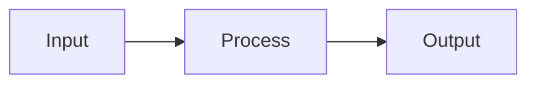

# Media Embed Processor

Process and embed media in the article.

## Setup

1. **Load Article**
   - Read `articles/[slug]/article.json`
   - Read `articles/[slug]/output/article.md`
   - Read `articles/[slug]/research/sources.json`

2. **Find Media Placeholders**
   - Scan for `<!-- YOUTUBE: ... -->` comments
   - Note any `[EMBED: ...]` markers from outline

## YouTube Embed Process

### 1. Extract Video IDs
From YouTube URLs like:
- `https://youtube.com/watch?v=VIDEO_ID`
- `https://youtu.be/VIDEO_ID`

Extract the video ID.

### 2. Generate Embed HTML
Replace placeholders with responsive embed:

```html
<div style="position: relative; padding-bottom: 56.25%; height: 0; overflow: hidden;">
  <iframe
    src="https://www.youtube.com/embed/VIDEO_ID"
    style="position: absolute; top: 0; left: 0; width: 100%; height: 100%;"
    frameborder="0"
    allow="accelerometer; autoplay; clipboard-write; encrypted-media; gyroscope; picture-in-picture"
    allowfullscreen>
  </iframe>
</div>

*[Video Title](https://youtube.com/watch?v=VIDEO_ID)*
```

### 3. Find Additional Videos (if needed)
If sections lack video content:
- Use WebSearch: `site:youtube.com [section topic] tutorial 2024`
- Pick highest quality/most relevant
- Add to appropriate section

## Mermaid Diagrams

If `[DIAGRAM: ...]` markers exist, generate mermaid:

```markdown

```

## Output

### 1. Update article.md
- Replace all YouTube placeholders with embeds
- Add mermaid diagrams where marked
- Ensure consistent formatting

### 2. Update article.json
```json
{
  "youtube_embeds": [
    {
      "video_id": "...",
      "title": "...",
      "section": "section-id",
      "url": "..."
    }
  ]
}
```

### 3. Append to progress.txt
```
[timestamp] Media embedded
- YouTube videos: N
- Diagrams added: N
```

## Completion

Summarize:
- Videos embedded
- Diagrams created
- Next step: run `/review`
